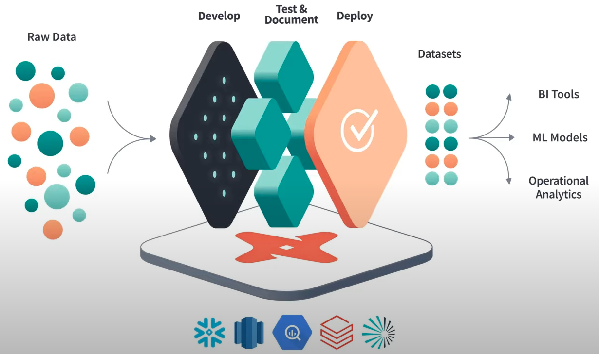
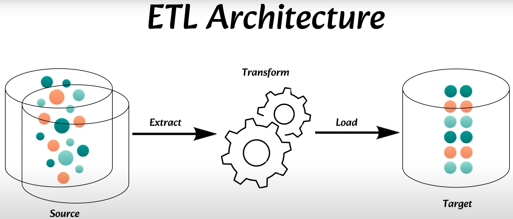
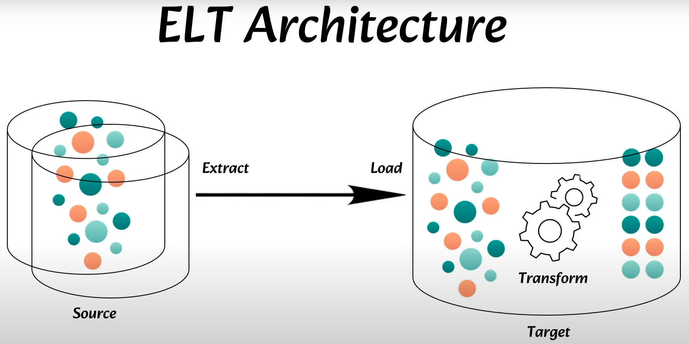

summary: "A detailed DBT guide"
id: dbt_lab
authors: "Uday Kiran"
categories: "Data Engineering, ELT, DBT"
tags: "dbt, Snowflake, ELT, Data Transformation"
status: "draft"
feedback: "mailto:udaykiranchintu16@gmail.com"

# DBT - Data Build Tool
## Introduction to DBT
### What is DBT?
DBT (Data Build Tool) is an SQL-based transformation tool that enables data engineers and analysts to transform data inside a data warehouse. It is widely used to implement ELT (Extract-Load-Transform) workflows.

Unlike traditional ETL (Extract-Transform-Load) tools, DBT does not extract or load data; instead, it focuses only on the transformation step. It allows users to write modular SQL code, apply version control using Git, and ensure data quality through testing.

### Why Use DBT?
- Automated Data Transformations: Standardizes and simplifies SQL-based data transformations.
- Improves Data Quality: Implements tests to validate data before usage.
- Modular & Scalable: Encourages a structured approach with staging, marts, and fact tables.
- Works Seamlessly with Data Warehouses: Optimized for cloud data warehouses like Snowflake, BigQuery, and Redshift.
- Integrates with Git & CI/CD Pipelines: Supports version control and automated deployments.


------------------
## ETL or ELT???
### Understanding ELT vs. ETL
### ETL (Extract-Transform-Load)
- Data is extracted from sources, transformed in an external processing environment, and then loaded into the data warehouse.
- Disadvantages: Complex processing pipelines, costly infrastructure for transformation, and slower query performance.
### ELT (Extract-Load-Transform)
- Data is extracted and loaded as raw data into the warehouse first.
- Transformations occur inside the data warehouse, leveraging its computing power.
- Advantages: Cost-efficient, scalable, and allows for more flexible transformations.

**ETL**


**ELT**


`DBT is optimized for ELT workflows, making it an essential tool for modern cloud-based data warehousing.`

-------------------
## Explanation of DBT Project Structure

**models/**	- Contains SQL models for data transformations. Organized into subfolders.

**models/staging/**	- Contains staging models that clean and standardize raw data.

**models/marts/** - Stores the final transformed tables (fact & dimension tables).

**models/intermediate/** - Intermediate transformations used between staging and marts.

**tests/** - Contains custom SQL-based singular tests. Generic Tests (Built-in): These tests validate column constraints. Singular Tests (Custom SQL): Singular tests use custom queries to validate business rules.

**macros/**	- Stores reusable SQL logic functions.

**seeds/** - Holds static CSV data that DBT can import into Snowflake.

**snapshots/** - Tracks historical changes in data (slowly changing dimensions).

**dbt_project.yml** - Main DBT configuration file.

**profiles.yml** - Stores database connection details.

----
### Types of DBT Models
1. Staging Models (stg_*)
    - Purpose: Cleans and standardizes raw data before further transformations.
    - Why? Ensures data is formatted properly for downstream transformations.
    - Stored as: Views (not tables) for better performance.

2. Intermediate Models (int_*)
    -   Purpose: Aggregates data from staging models before creating final marts.
    - Why? Helps in organizing reusable logic before the final reporting tables.
    - Stored as: Either tables or views.

3. Marts Models (fct_* and dim_*)

Fact Tables (fct_*)
    
    - Contains numeric metrics and transactional data (e.g., total sales, revenue).
    - Why? Helps with analytical queries and reporting.

Dimension Tables (dim_*)
    
    - Contains descriptive attributes (e.g., customer names, product categories).
    - Why? Helps in slicing and dicing the data for analysis.
-------------------------------------------------
## Installation of DBT

```CMD 
pip install dbt-core dbt-snowflake
```

### Setup snowflake environment

This is to be run in the snowflake workbook

``` SQL
-- create accounts
use role accountadmin; 
create warehouse dbt_wh with warehouse_size='x-small';
create database if not exists dbt_db;
create role if not exists dbt_role;

show grants on warehouse dbt_wh;

grant role dbt_role to user jayzern;
grant usage on warehouse dbt_wh to role dbt_role;
grant all on database dbt_db to role dbt_role;

use role dbt_role;

create schema if not exists dbt_db.dbt_schema;

-- clean up
use role accountadmin;

drop warehouse if exists dbt_wh;
drop database if exists dbt_db;
drop role if exists dbt_role;
```


## DBT Project Initialization

- Command to Start a DBT Project
``` CMD 
dbt init 
```
Steps after the above command
- name: data_pipeline
- db: Snowflake
- Account & Password for Snowflake
- role: dbt_role
- warehouse: dbt_wh
- db: dbt_db
- schema: dbt_schema
- threads: 10 (can give anything)


## Configuring dbt_profile.yaml

- Main file for the dbt-project.
``` yaml
models:
  snowflake_workshop:
    staging:
      materialized: view
      snowflake_warehouse: dbt_wh
    marts:
      materialized: table
      snowflake_warehouse: dbt_wh
```

- Create new folders in models- staging and marts
- Creation of few tables and views i.e., staging and marts


Before proceeding let's get a few necessary packages for our transformations
- Installing 3rd party libraries 
- Create new fodler packages.yaml

``` YAML
packages:
  - package: 'dbt-labs/dbt_utils'
    version: '1.3.0'
```

- Install Packages
``` CMD
dbt deps
```

## Setup Source and Staging files

**`models/staging/tpch_sources.yml`**

```yaml
version: 2

sources:
  - name: tpch
    database: snowflake_sample_data
    schema: tpch_sf1
    tables:
      - name: orders
        columns:
            # writing a few tests here to validate Generic tests
          - name: o_orderkey
            tests:
              - unique
              - not_null
      - name: lineitem
        columns:
          - name: l_orderkey # foreign key check using the test
            tests:
              - relationships:
                  to: source('tpch', 'orders')
                  field: o_orderkey
```


Create **`models/staging/stg_tpch_orders.sql`**

``` SQL
select
*
from
    {{ source('tpch', 'orders') }}
```

Run the created file and check if the table is created in snowflake or not

``` CMD
dbt run
```

Modify the stg_tpch_orders.sql and run again

``` SQL
select
    o_orderkey as order_key,
    o_custkey as customer_key,
    o_orderstatus as status_code,
    o_totalprice as total_price,
    o_orderdate as order_date
from
    {{ source('tpch', 'orders') }}
```

``` CMD 
dbt run -s stg_tpch_orders.sql
```

 Create one more view for line_items **`models/staging/tpch/stg_tpch_line_items.sql`**

``` SQL
select
    {{
        dbt_utils.generate_surrogate_key([
            'l_orderkey',
            'l_linenumber'
        ])
    }} as order_item_key,
	l_orderkey as order_key,
	l_partkey as part_key,
	l_linenumber as line_number,
	l_quantity as quantity,
	l_extendedprice as extended_price,
	l_discount as discount_percentage,
	l_tax as tax_rate
from
    {{ source('tpch', 'lineitem') }}

```

``` CMD
dbt run -s stg_tpch_line_items.sql
```

## Transformations on Staging tables

- Performs a few computations on the line items tables and create fact tables. ( these are used in Dimensional Modeling, these are the tables that contain data about the numeric measures by operations on raw data. )


### Macros Creation

- Reusable logic across different files

**`macros/pricing.sql`**

``` SQL

    (-1 * {{extended_price}} * {{discount_percentage}})::decimal(16, {{ scale }})

```

### Transformations

Create file **`models/marts/int_order_items.sql`**

``` SQL

select
    line_item.order_item_key,
    line_item.part_key,
    line_item.line_number,
    line_item.extended_price,
    orders.order_key,
    orders.customer_key,
    orders.order_date,
    {{ discounted_amount('line_item.extended_price', 'line_item.discount_percentage') }} as item_discount_amount
from
    {{ ref('stg_tpch_orders') }} as orders
join
    {{ ref('stg_tpch_line_items') }} as line_item
        on orders.order_key = line_item.order_key
order by
    orders.order_date

```

``` CMD
dbt run -s int_order_items
```

Creation of other intermediate files

**`marts/int_order_items_summary.sql`**

``` SQL

select 
    order_key,
    sum(extended_price) as gross_item_sales_amount,
    sum(item_discount_amount) as item_discount_amount
from
    {{ ref('int_order_items') }}
group by
    order_key
```

Creation of a fact model
**`models/marts/fct_orders.sql`**

``` SQL
select
    orders.*,
    order_item_summary.gross_item_sales_amount,
    order_item_summary.item_discount_amount
from
    {{ref('stg_tpch_orders')}} as orders
join
    {{ref('int_order_items_summary')}} as order_item_summary
        on orders.order_key = order_item_summary.order_key
order by order_date

```

``` CMD
dbt run
```

- CHECK SNOWFLAKE, Tables are created in snowflake

### Testing
Generic Test creation in marts folder

**`models/marts/generic_tests.yml`**

``` YAML
models:
  - name: fct_orders
    columns:
      - name: order_key
        tests:
          - unique
          - not_null
          - relationships:
              to: ref('stg_tpch_orders')
              field: order_key
              severity: warn
      - name: status_code
        tests:
          - accepted_values:
              values: ['P', 'O', 'F']
```

``` CMD
dbt test
```

**Singular Tests**

- Check if the discount amount is always greater than zero or not.

**`tests/fct_orders_discount.sql`**

``` SQL
select
    *
from
    {{ref('fct_orders')}}
where
    item_discount_amount > 0

```

- One more singular test to make sure the order date is in a specific range

**`tests/fct_orders_date_valid.sql`**

``` SQL
select
    *
from
    {{ref('fct_orders')}}
where
    date(order_date) > CURRENT_DATE()
    or date(order_date) < date('1990-01-01')
```


## DBT Documentation & Lineage Graph
Generate DBT documentation so students can explore DBT model relationships.
``` CMD
dbt docs generate
dbt docs serve
```


## Deploying on Airflow

why are we using Astronomer-Cosmos?

- Provides a wrapper for DBT inside Airflow DAGs.
- Simplifies running DBT without writing complex BashOperator scripts.

**Steps for Airflow Deployment**
1. **Command to install astro library**

``` CMD
brew install astro
```

**[Astro Installation Guide](https://www.astronomer.io/docs/astro/cli/install-cli/)**

Check if you have successfully installed ASTRO or not
``` CMD
astro version
```

2. **Initialize Airflow project - astro**

**[Guide for deploying AIRFLOW for DBT using ASTRO](https://astronomer.github.io/astronomer-cosmos/getting_started/astro.html)**

``` CMD
astro dev init
```
The above command creates a new astro project.

3. **Navigate into the astro directory, modify the docker file and requirements.txt as below**

**DOCKERFILE**
``` DOCKER
FROM quay.io/astronomer/astro-runtime:11.3.0

# install dbt into a virtual environment
RUN python -m venv dbt_venv && source dbt_venv/bin/activate && \
    pip install --no-cache-dir dbt-snowflake && deactivate
```

**Requirements.txt**
``` TXT
astronomer-cosmos
apache-airflow-providers-snowflake
```


4. **Move your dbt project into DAGS directory**

Sample directory structure
```
├── dags/
│   ├── dbt/
│   │   └── my_dbt_project/
│   │       ├── dbt_project.yml
│   │       ├── models/
│   │       │   ├── my_model.sql
│   │       │   └── my_other_model.sql
│   │       └── macros/
│   │           ├── my_macro.sql
│   │           └── my_other_macro.sql
│   └── my_cosmos_dag.py
├── Dockerfile
├── requirements.txt
```

5. **Write a Dag file**
create a DAG file in the dag folder with any name "my_cosmos_dag.py"

**DAG File for Airflow**

``` python
import os
from datetime import datetime

from cosmos import DbtDag, ProjectConfig, ProfileConfig, ExecutionConfig
from cosmos.profiles import SnowflakeUserPasswordProfileMapping


profile_config = ProfileConfig(
    profile_name="default",
    target_name="dev",
    profile_mapping=SnowflakeUserPasswordProfileMapping(
        conn_id="snowflake_conn", 
        profile_args={"database": "dbt_db", "schema": "dbt_schema"},
    )
)

dbt_snowflake_dag = DbtDag(
    project_config=ProjectConfig("/usr/local/airflow/dags/dbt/data_pipeline",),
    operator_args={"install_deps": True},
    profile_config=profile_config,
    execution_config=ExecutionConfig(dbt_executable_path=f"{os.environ['AIRFLOW_HOME']}/dbt_venv/bin/dbt",),
    schedule_interval="@daily",
    start_date=datetime(2023, 9, 10),
    catchup=False,
    dag_id="dbt_dag",
)
​
```

6. **Start Airflow**

- run the following command to start the airflow server ( Airflow docker container) 
``` CMD
astro dev start
```

`You'll get the airflow credentials in your terminal`

Once you login you should be able to see the dag we have created.
Now setup up your snowflake connection in the Airflow UI by filling the following details

7. **Establish Snowflake Connection in Airflow UI**

Navigate to `ADMIN>CONNECTIONS`

```
Connection_id: snowflake_conn

Connection type: Snowflake

Snowflake Schema: dbt_schema

Login: < USER NAME>

Password: <PASSWORD>

Account: <YOUR ACCOUNT IDENTIFIER>

Warehouse: dbt_wh

Database: dbt_db

Role: dbt_role
```

# Finally Trigger The DAG!!!!!